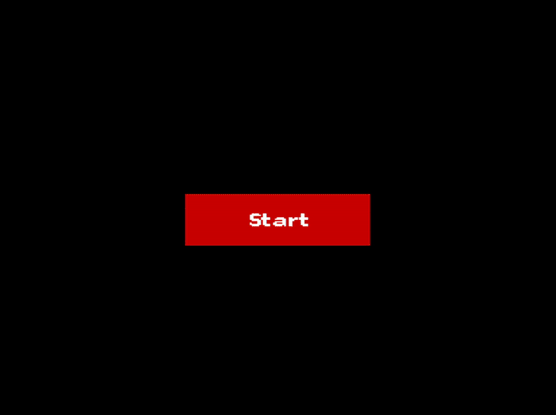

# 🐍 Snake Game (C++ & SFML)


A **classic Snake game** implemented using [SFML (Simple and Fast Multimedia Library)](https://www.sfml-dev.org/) in **C++17**.  
The snake grows as it eats food, but colliding with walls or itself ends the game.

---

## 🎮 Features

- 🖥️ **800×600 SFML window**
- ⌨️ Smooth snake movement with **arrow key controls**
- 🍏 **Randomly spawning food** that makes the snake grow
- 🐍 Snake body growth mechanics
- 💥 Collision detection with **walls & self**
- 🏆 **Score system** + restart after game over

---

## 📸 Preview



---

## ⚙️ Prerequisites

- **SFML 2.5+** installed and linked properly
- **C++17** compatible compiler (g++, MSVC, clang, etc.)
- An IDE like **Visual Studio**, **CLion**, or a build tool like **CMake**

---

## 🚀 Setup Instructions

1. **Clone the repository**
   ```bash
   git clone https://github.com/JitChowDhury/RetroSnake-SFML.git
   ```
